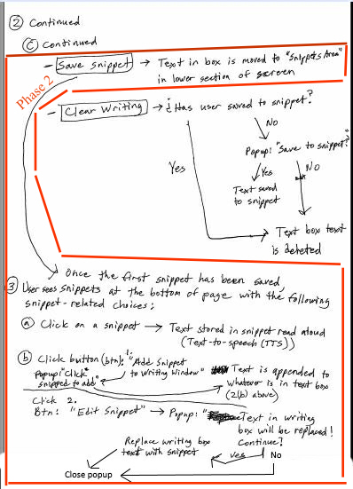
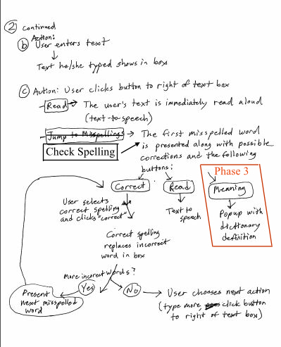
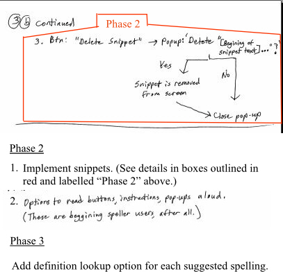

# Write to Speak - Thinkful API Capstone Project

A responsive website that pulls data from two APIs, LanguageTool (https://languagetool.org/api) and Responsive Voice (https://responsivevoice.org/api/) to encourage beginning spellers to write by helping with spelling and reading their writing back to them. Designed so that even one-fingered typists can use it.

## User Cases

This app is for users that fall into these categories, none of which are mutually exclusive:

1.  As a beginning speller who often spells phonetically or inverts or leaves out letters, I want help correcting my spelling.
2.  As a beginning reader, I want help reading back what I have written.
3.  As a person with a speech challenge, I want help speaking to others in the same room.

### UI Flow

   

### Wireframe 1\. Intro/Home page

### Wireframe 2\. Inner page before user interaction

### Wireframe 3\. Inner page after user interaction

## Working Prototype

You can access a working prototype of the app at (https://goldtreefrog.github.io/write-to-speak-api-capstone/)

## Functionality

The app's functionality includes:

*   An area for the user to input his/her text.
*   A function to read the user's text aloud.
*   A spell checker which offers possible correct spellings.
*   The ability for the user to save chunks of text for the duration of the session (since no database is involved - yet) and assign them to objects on the screen. Each such object will show the first few words of the text in that chunk.
*   The ability for the user to append previously-saved chunks of text to the text writing/editing area so that such chunks can be strung together in new ways and the final result spoken aloud.

## Technology

*   HTML
*   CSS
*   JavaScript
*   jQuery
*   The app uses AJAX JSON calls to the [LanguageTool](https://languagetool.org/api) API to check spellings and return suggestions for misspelled words.
*   The app uses AJAX JSON calls to the [Responsive Voice](http://www.convert-unix-time.com/api) Open Platform API to translate written text to speech and return voice output.

## Responsive

App is built to be responsive across mobile, tablet, laptop, and desktop screen resolutions.

## Development Roadmap

This is v1.0 of the app, but future enhancements are expected to include:

*   Option(s) to read the instructions and buttons to the user. (Remember the target audience is beginning spellers who probably do not read very well.)
*   A "snippets" feature for temporarily storing words, phrases and longer text to new buttons, which the user can then click to speak them back. For example, the user could store "Mom" in one snippet, "Dad" in another, "I love you" in a third, and "I am hungry" in a fourth. After that, the user could make the computer say, "Mom, I am hungry" in just two clicks without having to retype anything.
*   An attached database and login capabilities so that users can store their snippets for later sessions.
*   Look up the meanings of selected word in English dictionary.